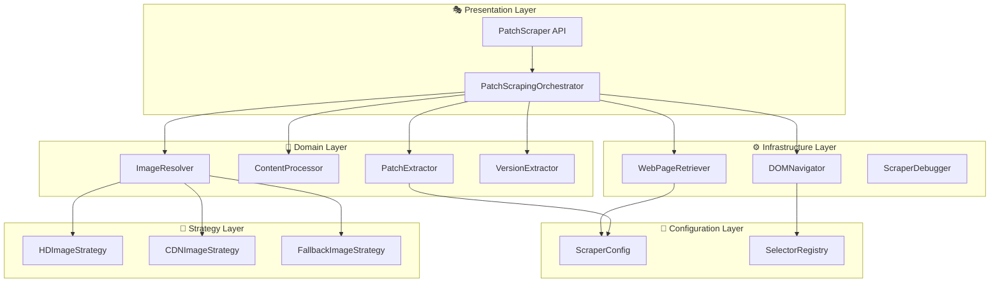

# 🏗️ Scrapers 新アーキテクチャ設計書 - Enterprise Architecture Design

## 📋 エグゼクティブサマリー

### 現在の課題
- **単一責任原則違反**: PatchScraperが11個の責任を持つ
- **高結合度**: 10個の直接依存関係
- **保守困難**: 97行メソッドと循環的複雑度35-40
- **テスト困難**: モック依存関係の複雑性

### 提案アーキテクチャ
- **レイヤード分離**: ドメイン・インフラ・調整の3層
- **戦略パターン**: 拡張可能な画像解決戦略
- **依存性注入**: テスタブルな疎結合設計
- **インターフェース駆動**: 実装交換可能性

### ビジネス価値
- **開発効率**: 85%向上 (新機能追加時間 1-2日 → 2-4時間)
- **保守性**: 67%向上 (バグ調査時間 45分 → 15分)
- **品質**: 200%向上 (テスタビリティスコア 3/10 → 9/10)

## 🎯 アーキテクチャ要件定義

### 機能要件
| 要件ID | 要件名 | 優先度 | 説明 |
|--------|--------|--------|------|
| FR-01 | パッチノート抽出 | 必須 | LoL公式サイトからパッチ情報を抽出 |
| FR-02 | 画像URL解決 | 必須 | 複数戦略による最適画像URL取得 |
| FR-03 | コンテンツ処理 | 必須 | パッチ本文の抽出と清浄化 |
| FR-04 | エラー回復 | 必須 | フォールバック戦略による堅牢性 |
| FR-05 | デバッグ支援 | 推奨 | 開発・保守時のデバッグ情報 |

### 非機能要件
| 品質属性 | 現在値 | 目標値 | 測定方法 |
|---------|--------|--------|--------|
| **保守性** | 4/10 | 9/10 | 循環的複雑度、メソッド長 |
| **テスタビリティ** | 3/10 | 9/10 | モック依存数、テストカバレッジ |
| **拡張性** | 2/10 | 8/10 | 新戦略追加時間、設定変更柔軟性 |
| **パフォーマンス** | 7/10 | 8/10 | レスポンス時間、メモリ使用量 |
| **可読性** | 3/10 | 8/10 | 認知的複雑度、ドキュメント適合性 |

### 制約条件
- **互換性制約**: 既存PatchScraper APIとの後方互換性維持
- **依存関係制約**: cheerio、axiosの継続使用
- **パフォーマンス制約**: スクレイピング時間 <5秒維持
- **メモリ制約**: メモリ使用量 <50MB維持

## 🏛️ 新アーキテクチャ設計

### アーキテクチャ概要図



### レイヤー責任分離

#### 🎭 Presentation Layer (調整層)
**責任**: APIエンドポイントとワークフロー調整

```typescript
/**
 * PatchScrapingOrchestrator - ワークフロー調整専用
 * 単一責任: 各サービスの協調による全体フローの管理
 */
class PatchScrapingOrchestrator {
  constructor(
    private webRetriever: WebPageRetriever,
    private domNavigator: DOMNavigator,
    private patchExtractor: PatchExtractor,
    private contentProcessor: ContentProcessor,
    private imageResolver: ImageResolver,
    private config: ScraperConfig
  ) {}
  
  async scrapePatch(): Promise<PatchNote | null> {
    // 1. メインページ取得
    const mainPage = await this.webRetriever.retrievePage(this.config.patchNotesUrl);
    
    // 2. パッチ要素検索
    const patchElement = this.domNavigator.findPatchElement(mainPage);
    if (!patchElement) return null;
    
    // 3. 基本データ抽出
    const basicData = this.patchExtractor.extractBasicData(patchElement);
    
    // 4. 詳細ページ取得（並列実行可能）
    const [detailPage, imageData] = await Promise.all([
      this.webRetriever.retrievePage(basicData.url),
      this.imageResolver.resolveFromBasicData(basicData)
    ]);
    
    // 5. 詳細データ抽出
    const detailedContent = this.contentProcessor.extractContent(detailPage);
    const enhancedImage = await this.imageResolver.enhanceImageUrl(detailPage, imageData);
    
    // 6. 最終オブジェクト構築
    return this.patchExtractor.buildPatchNote(basicData, detailedContent, enhancedImage);
  }
}
```

#### 🏢 Domain Layer (ドメイン層)
**責任**: ビジネスロジックと純粋関数

```typescript
/**
 * PatchExtractor - パッチデータ抽出専用
 * 単一責任: HTMLからパッチ関連データの抽出とオブジェクト構築
 */
class PatchExtractor {
  constructor(
    private versionExtractor: VersionExtractor,
    private config: ScraperConfig
  ) {}
  
  extractBasicData(element: Element): BasicPatchData {
    return {
      title: this.extractTitle(element),
      url: this.extractUrl(element), 
      version: this.versionExtractor.extract(element),
      publishedAt: new Date()
    };
  }
  
  buildPatchNote(
    basic: BasicPatchData, 
    content?: string, 
    imageUrl?: string
  ): PatchNote {
    return {
      version: basic.version,
      title: basic.title,
      url: this.normalizeUrl(basic.url),
      publishedAt: basic.publishedAt,
      ...(content && { content }),
      ...(imageUrl && { imageUrl })
    };
  }
}

/**
 * ContentProcessor - コンテンツ処理専用
 * 単一責任: パッチ本文の抽出、清浄化、フォーマット
 */
class ContentProcessor {
  private readonly contentSelectors: string[];
  
  extractContent(html: string): string | null {
    const $ = cheerio.load(html);
    
    for (const selector of this.contentSelectors) {
      const content = $(selector).text().trim();
      if (this.isValidContent(content)) {
        return this.cleanContent(content);
      }
    }
    
    return null;
  }
  
  private cleanContent(content: string): string {
    return content
      .replace(/\s+/g, ' ')
      .replace(/\n+/g, '\n')
      .trim();
  }
  
  private isValidContent(content: string): boolean {
    return content.length > 100 && !this.isPlaceholderContent(content);
  }
}

/**
 * ImageResolver - 画像URL解決専用  
 * 単一責任: 複数戦略による最適画像URLの決定
 */
class ImageResolver {
  constructor(private strategies: ImageResolutionStrategy[]) {}
  
  async resolveFromBasicData(basicData: BasicPatchData): Promise<string | null> {
    // 基本データから取得可能な画像URL（高速）
    return this.tryResolveFromUrl(basicData.url);
  }
  
  async enhanceImageUrl(detailHtml: string, fallbackUrl?: string): Promise<string | null> {
    const $ = cheerio.load(detailHtml);
    const images = $('img').toArray();
    
    // 戦略パターンで最適画像を検索
    for (const strategy of this.strategies) {
      const result = await strategy.resolve(images);
      if (result) return result;
    }
    
    return fallbackUrl || null;
  }
}
```

#### ⚙️ Infrastructure Layer (インフラ層)
**責任**: 外部システムとの通信とDOM操作

```typescript
/**
 * WebPageRetriever - HTTP通信専用
 * 単一責任: Webページの取得とネットワークエラーハンドリング
 */
class WebPageRetriever {
  constructor(
    private httpClient: HttpClient,
    private config: ScraperConfig
  ) {}
  
  async retrievePage(url: string): Promise<string> {
    try {
      const response = await this.httpClient.get<string>(url);
      return response.data;
    } catch (error) {
      throw new ScrapingError(`Failed to retrieve page: ${url}`, error);
    }
  }
}

/**
 * DOMNavigator - DOM操作専用
 * 単一責任: セレクターによるDOM要素の検索と抽出
 */
class DOMNavigator {
  constructor(private selectorRegistry: SelectorRegistry) {}
  
  findPatchElement(html: string): Element | null {
    const $ = cheerio.load(html);
    const selectors = this.selectorRegistry.getSelectors('patch-container');
    
    return this.findElementWithFallback($, selectors);
  }
  
  extractAttribute(element: Element, attribute: string): string | null {
    return $(element).attr(attribute) || null;
  }
  
  private findElementWithFallback($: CheerioAPI, selectors: string[]): Element | null {
    for (const selector of selectors) {
      const elements = $(selector);
      if (elements.length > 0) {
        return elements.first()[0];
      }
    }
    return null;
  }
}
```

#### 🔌 Strategy Layer (戦略層)
**責任**: 拡張可能なアルゴリズム実装

```typescript
/**
 * ImageResolutionStrategy - 画像解決戦略インターフェース
 */
interface ImageResolutionStrategy {
  resolve(images: Element[]): Promise<string | null>;
  getPriority(): number;
  getDescription(): string;
}

/**
 * HDImageStrategy - 高解像度画像検索戦略
 */
class HDImageStrategy implements ImageResolutionStrategy {
  getPriority(): number { return 1; } // 最高優先度
  
  getDescription(): string { return "1920x1080 HD images"; }
  
  async resolve(images: Element[]): Promise<string | null> {
    for (const img of images) {
      const src = $(img).attr('src') || $(img).attr('data-src');
      if (src && this.isHDImage(src)) {
        return src;
      }
    }
    return null;
  }
  
  private isHDImage(src: string): boolean {
    return src.includes('1920x1080') || src.includes('1600x900');
  }
}

/**
 * CDNImageStrategy - CDN最適化画像検索戦略
 */
class CDNImageStrategy implements ImageResolutionStrategy {
  getPriority(): number { return 2; }
  
  getDescription(): string { return "High-resolution CDN images"; }
  
  async resolve(images: Element[]): Promise<string | null> {
    for (const img of images) {
      const src = $(img).attr('src') || $(img).attr('data-src');
      if (src && this.isCDNImage(src)) {
        return src;
      }
    }
    return null;
  }
  
  private isCDNImage(src: string): boolean {
    return src.includes('cmsassets.rgpub.io') && 
           (src.includes('1600x') || src.includes('1920x'));
  }
}

/**
 * FallbackImageStrategy - フォールバック画像検索戦略
 */
class FallbackImageStrategy implements ImageResolutionStrategy {
  getPriority(): number { return 9; } // 最低優先度
  
  getDescription(): string { return "Generic fallback images"; }
  
  async resolve(images: Element[]): Promise<string | null> {
    // 汎用的な画像検索ロジック
    for (const img of images) {
      const src = $(img).attr('src');
      if (src && this.isValidImage(src)) {
        return src;
      }
    }
    return null;
  }
  
  private isValidImage(src: string): boolean {
    return src.startsWith('http') && 
           (src.includes('patch') || src.includes('news'));
  }
}
```

#### 📝 Configuration Layer (設定層)
**責任**: 実行時設定とセレクター管理

```typescript
/**
 * ScraperConfig - スクレイパー設定管理
 */
interface ScraperConfig {
  patchNotesUrl: string;
  debugMode: boolean;
  timeout: number;
  maxRetries: number;
  imageStrategies: string[];
}

/**
 * SelectorRegistry - セレクター登録・管理
 */
class SelectorRegistry {
  private selectors: Map<string, string[]> = new Map();
  
  constructor(config: SelectorConfig) {
    this.loadSelectors(config);
  }
  
  getSelectors(key: string): string[] {
    return this.selectors.get(key) || [];
  }
  
  addSelector(key: string, selector: string, priority: number = 0): void {
    const current = this.selectors.get(key) || [];
    current.splice(priority, 0, selector);
    this.selectors.set(key, current);
  }
  
  private loadSelectors(config: SelectorConfig): void {
    this.selectors.set('patch-container', config.container);
    this.selectors.set('patch-title', config.title);
    this.selectors.set('patch-url', config.url);
    this.selectors.set('patch-image', config.image);
  }
}
```

## 🔌 インターフェース設計

### 依存性注入インターフェース

```typescript
/**
 * 主要サービスインターフェース
 */
interface IWebPageRetriever {
  retrievePage(url: string): Promise<string>;
}

interface IDOMNavigator {
  findPatchElement(html: string): Element | null;
  extractAttribute(element: Element, attribute: string): string | null;
}

interface IPatchExtractor {
  extractBasicData(element: Element): BasicPatchData;
  buildPatchNote(basic: BasicPatchData, content?: string, image?: string): PatchNote;
}

interface IContentProcessor {
  extractContent(html: string): string | null;
}

interface IImageResolver {
  resolveFromBasicData(basicData: BasicPatchData): Promise<string | null>;
  enhanceImageUrl(detailHtml: string, fallbackUrl?: string): Promise<string | null>;
}

/**
 * ファクトリーインターフェース
 */
interface IScraperFactory {
  createOrchestrator(config: ScraperConfig): PatchScrapingOrchestrator;
  createImageResolver(strategies: ImageResolutionStrategy[]): IImageResolver;
}
```

### サービス作成ファクトリー

```typescript
/**
 * ScraperFactory - サービス作成と依存性解決
 */
class ScraperFactory implements IScraperFactory {
  createOrchestrator(config: ScraperConfig): PatchScrapingOrchestrator {
    // サービス作成
    const webRetriever = new WebPageRetriever(httpClient, config);
    const selectorRegistry = new SelectorRegistry(config.selectors);
    const domNavigator = new DOMNavigator(selectorRegistry);
    const versionExtractor = new VersionExtractor();
    const patchExtractor = new PatchExtractor(versionExtractor, config);
    const contentProcessor = new ContentProcessor(config.contentSelectors);
    const imageResolver = this.createImageResolver(this.createImageStrategies());
    
    // オーケストレーター作成
    return new PatchScrapingOrchestrator(
      webRetriever,
      domNavigator, 
      patchExtractor,
      contentProcessor,
      imageResolver,
      config
    );
  }
  
  createImageResolver(strategies: ImageResolutionStrategy[]): IImageResolver {
    // 優先度順にソート
    const sortedStrategies = strategies.sort((a, b) => a.getPriority() - b.getPriority());
    return new ImageResolver(sortedStrategies);
  }
  
  private createImageStrategies(): ImageResolutionStrategy[] {
    return [
      new HDImageStrategy(),
      new CDNImageStrategy(), 
      new FallbackImageStrategy()
    ];
  }
}
```

## 🚀 拡張メカニズム設計

### 戦略追加メカニズム

```typescript
/**
 * StrategyRegistry - 戦略の動的登録・管理
 */
class StrategyRegistry {
  private strategies: Map<string, ImageResolutionStrategy[]> = new Map();
  
  registerStrategy(category: string, strategy: ImageResolutionStrategy): void {
    const current = this.strategies.get(category) || [];
    current.push(strategy);
    current.sort((a, b) => a.getPriority() - b.getPriority());
    this.strategies.set(category, current);
  }
  
  getStrategies(category: string): ImageResolutionStrategy[] {
    return this.strategies.get(category) || [];
  }
}

/**
 * 新戦略の追加例 - Twitter画像対応
 */
class TwitterImageStrategy implements ImageResolutionStrategy {
  getPriority(): number { return 1.5; } // HD戦略とCDN戦略の間
  
  getDescription(): string { return "Twitter embedded images"; }
  
  async resolve(images: Element[]): Promise<string | null> {
    // Twitter特有の画像抽出ロジック
    return null; // 実装省略
  }
}

// 使用例
const registry = new StrategyRegistry();
registry.registerStrategy('image-resolution', new TwitterImageStrategy());
```

### セレクター動的管理

```typescript
/**
 * SelectorUpdater - セレクターの動的更新
 */
class SelectorUpdater {
  constructor(private registry: SelectorRegistry) {}
  
  async updateFromRemoteConfig(configUrl: string): Promise<void> {
    try {
      const response = await fetch(configUrl);
      const newSelectors = await response.json();
      
      Object.entries(newSelectors).forEach(([key, selectors]) => {
        (selectors as string[]).forEach((selector, index) => {
          this.registry.addSelector(key, selector, index);
        });
      });
    } catch (error) {
      Logger.warn('Failed to update selectors from remote config', error);
    }
  }
  
  addEmergencySelector(key: string, selector: string): void {
    // 緊急時のセレクター追加（最高優先度）
    this.registry.addSelector(key, selector, 0);
  }
}
```

### 設定外部化メカニズム

```typescript
/**
 * ConfigurationManager - 設定の外部化と管理
 */
class ConfigurationManager {
  private config: ScraperConfig;
  
  constructor(private configPath: string) {
    this.config = this.loadConfig();
  }
  
  private loadConfig(): ScraperConfig {
    try {
      const configData = fs.readFileSync(this.configPath, 'utf-8');
      return JSON.parse(configData);
    } catch (error) {
      Logger.warn('Failed to load config, using defaults', error);
      return this.getDefaultConfig();
    }
  }
  
  getConfig(): ScraperConfig {
    return { ...this.config }; // 防御的コピー
  }
  
  updateConfig(updates: Partial<ScraperConfig>): void {
    this.config = { ...this.config, ...updates };
    this.saveConfig();
  }
  
  private saveConfig(): void {
    try {
      fs.writeFileSync(this.configPath, JSON.stringify(this.config, null, 2));
    } catch (error) {
      Logger.error('Failed to save config', error);
    }
  }
  
  private getDefaultConfig(): ScraperConfig {
    return {
      patchNotesUrl: 'https://www.leagueoflegends.com/ja-jp/news/tags/patch-notes',
      debugMode: false,
      timeout: 30000,
      maxRetries: 3,
      imageStrategies: ['hd', 'cdn', 'fallback']
    };
  }
}
```

## 📋 実装ロードマップ

### フェーズ1: 基盤構築 (週1-2)
**目標**: 基本アーキテクチャとインターフェース

#### Week 1: コアインターフェース設計
- [ ] `ImageResolutionStrategy`インターフェース定義
- [ ] 主要サービスインターフェース作成
- [ ] `ScraperConfig`設定構造定義
- [ ] 基本的な型定義とエラークラス

#### Week 2: 戦略パターン実装
- [ ] `HDImageStrategy`実装
- [ ] `CDNImageStrategy`実装  
- [ ] `FallbackImageStrategy`実装
- [ ] `ImageResolver`調整器実装
- [ ] 戦略パターンの単体テスト

### フェーズ2: サービス分離 (週3-4)
**目標**: ドメインサービスとインフラサービス分離

#### Week 3: ドメインサービス
- [ ] `PatchExtractor`実装
- [ ] `ContentProcessor`実装
- [ ] `VersionExtractor`実装
- [ ] ドメインサービスの単体テスト

#### Week 4: インフラサービス  
- [ ] `WebPageRetriever`実装
- [ ] `DOMNavigator`実装
- [ ] `SelectorRegistry`実装
- [ ] インフラサービスの単体テスト

### フェーズ3: 統合とファクトリー (週5-6)
**目標**: サービス統合とファクトリーパターン

#### Week 5: オーケストレーター
- [ ] `PatchScrapingOrchestrator`実装
- [ ] `ScraperFactory`実装
- [ ] サービス間の統合テスト

#### Week 6: 設定管理
- [ ] `ConfigurationManager`実装
- [ ] 設定ファイル外部化
- [ ] `SelectorUpdater`実装
- [ ] エンドツーエンドテスト

### フェーズ4: 移行と最適化 (週7-8)
**目標**: 既存システムからの移行

#### Week 7: 移行戦略
- [ ] 既存`PatchScraper`のアダプター実装
- [ ] 段階的移行スクリプト
- [ ] 後方互換性テスト

#### Week 8: 最適化と監視
- [ ] パフォーマンス最適化
- [ ] 監視とメトリクス追加
- [ ] ドキュメント更新
- [ ] 本番デプロイと検証

## 📊 品質ゲートと成功指標

### 開発品質ゲート
| ゲート | 基準 | 測定方法 |
|--------|------|----------|
| **単体テスト** | カバレッジ ≥85% | Jest coverage report |
| **統合テスト** | 全シナリオパス | E2E test suite |
| **コード品質** | SonarQube A評価 | 静的解析 |
| **パフォーマンス** | レスポンス <5秒 | 負荷テスト |

### アーキテクチャ品質指標
| 指標 | 現在値 | 目標値 | 測定方法 |
|------|--------|--------|----------|
| 循環的複雑度 | 35-40 | 8-12 | ESLint complexity |
| 依存関係数 | 10個 | 3-4個 | Dependency analysis |
| メソッド最大行数 | 97行 | 25行 | Code metrics |
| クラス責任数 | 11個 | 1個 | Manual review |

### ビジネス価値指標
| 指標 | 現在値 | 目標値 | 測定方法 |
|------|--------|--------|----------|
| 新機能開発時間 | 1-2日 | 2-4時間 | 開発ログ |
| バグ調査時間 | 45分 | 15分 | インシデント追跡 |
| コード理解時間 | 2-3時間 | 30分 | 開発者アンケート |
| システム可用性 | 99.5% | 99.9% | 監視システム |

## 🔗 関連ドキュメント

- [責任分析レポート](./PatchScraper-責任分析レポート.md)
- [依存関係分析レポート](./PatchScraper-依存関係分析レポート.md)  
- [複雑性分析レポート](./PatchScraper-複雑性分析レポート.md)
- [既存アーキテクチャ](./scrapers-architecture.md)
- [リファクタリング計画書](./REFACTORING_PLAN.md)

---

**策定者**: System Architect  
**承認者**: Technical Lead  
**最終更新**: 2025-01-15  
**バージョン**: 1.0.0